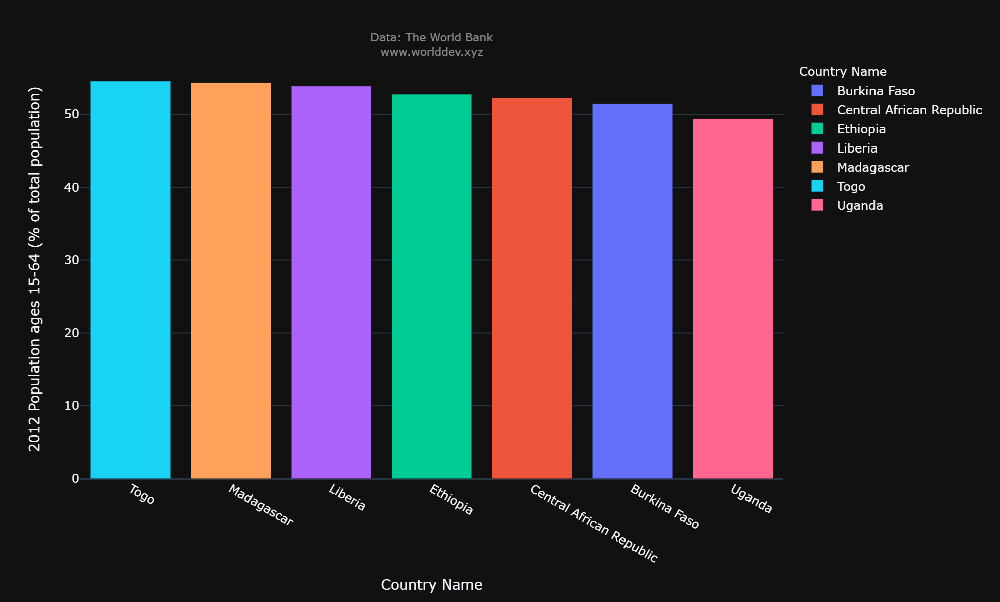
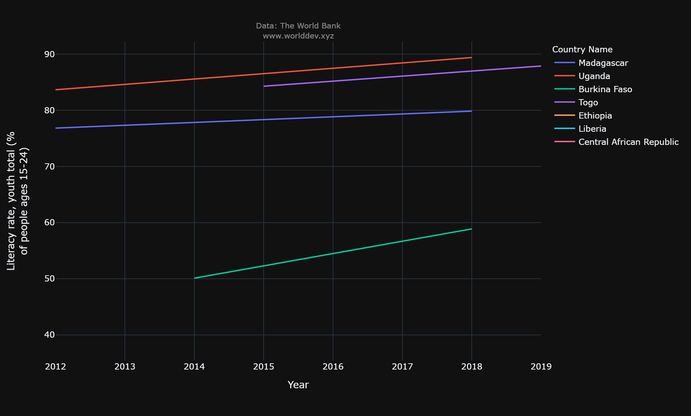
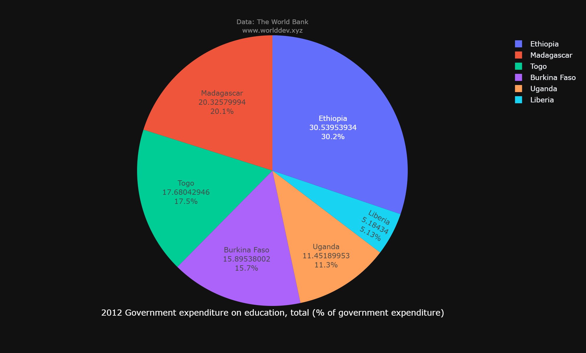
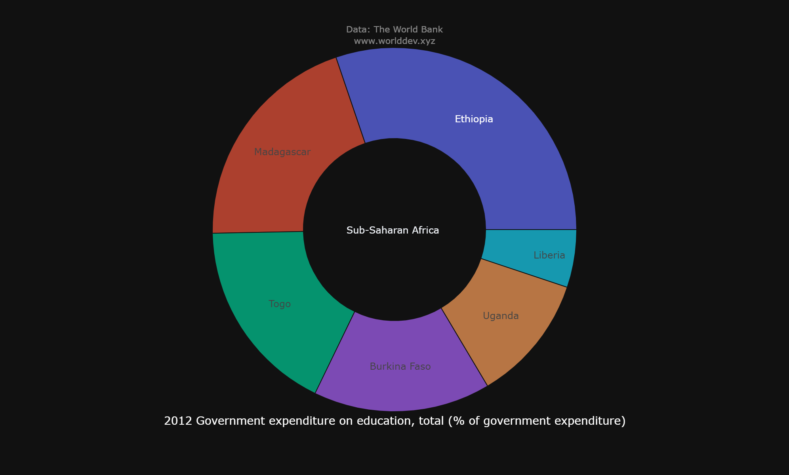
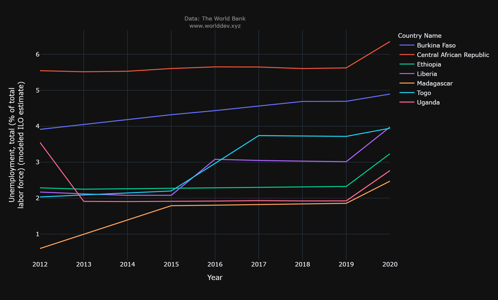
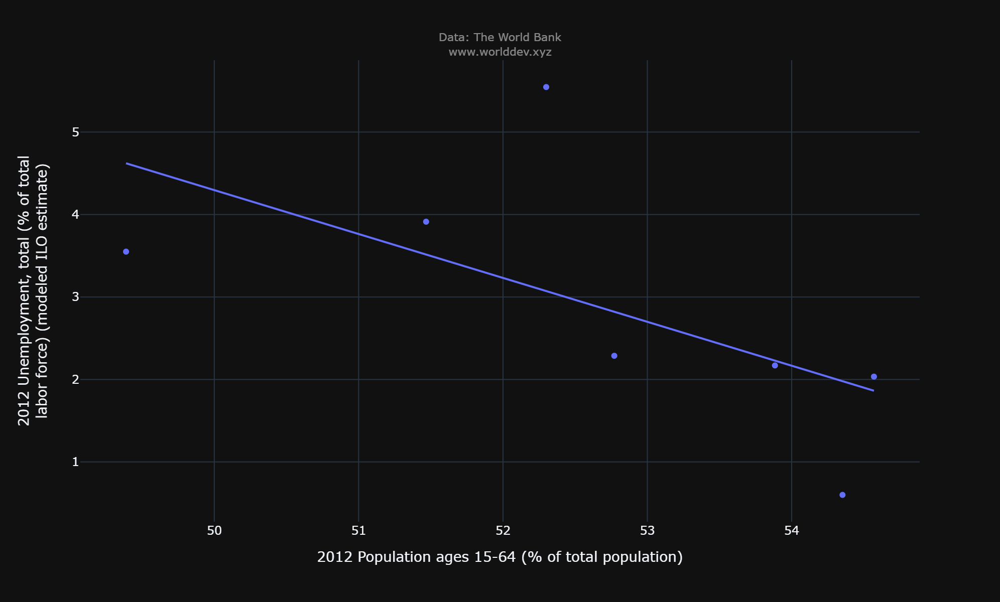
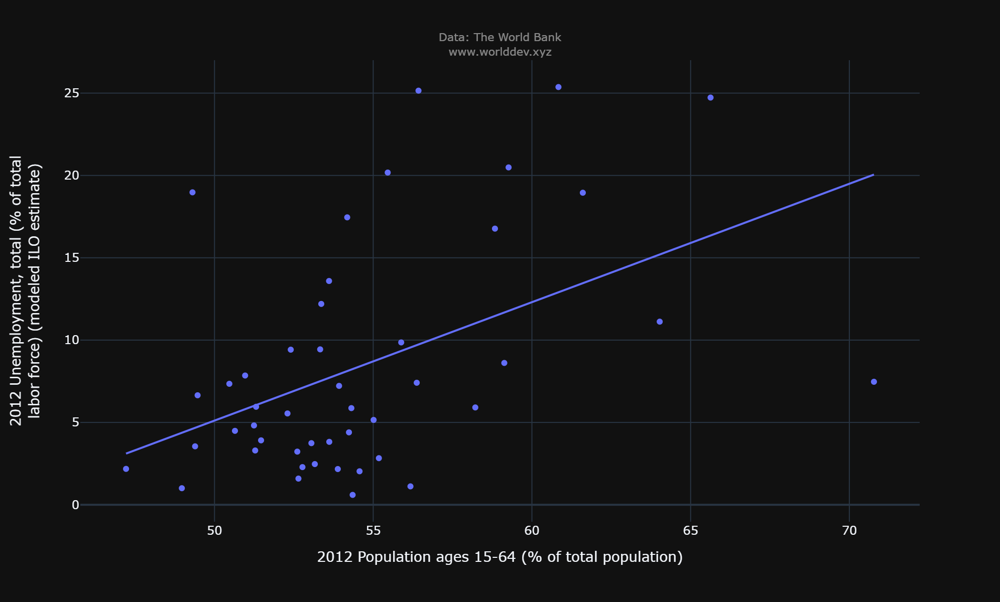

# Individual Project Part-A Draft
- Name: Karthik Reddy
- Date: 03/12/2022

## Indicator Profile: Education
### Basic Information:

- Education means studying in order to obtain a deeper knowledge and understanding of a variety of subjects to be applied to daily life. Education is not limited to just knowledge from books, but can also be obtained through practical experiences outside of the classroom.
- In order for the entire world to really become equal, it needs to start with education. If everyone was provided with the same opportunities to education, then there would be less gaps between social classes.
- In today’s society, having an education is considered a vital part of being accepted by those around you. Having an education is believed to make you a useful part of society, and can make you feel like a contributing member as well.

## Indicator Topics: 
- Population ages 15-64(% of total population).
- Literacy rate, youth total(% of people ages 15-24).
- Government expenditure on education, total(% of government expenditure).
- Unemployment, total(% of total labor force).
- Population, ages 15-24, total.

**Countries:**
- Burkina Faso.
- Ethiopia.
- Liberia.
- Madagascar.
- Uganda.
- Central African Republic.
- Togo.

**Time Plot Years:**
- 2012 - 2020. 

## Graphical Visualization: 

**Population ages 15-64(% of total population):**

- In the above given graph, we could observe that Togo being a small country stands in the first position with almost 55% of educated population from age 15 to 64. Followed bt Madagascar with 54.3% of second highest educated crowd. As we go through the bar graph, there is no big difference between all the seven countries we have opted for. Although, Uganda places in the last with about 49.3%.

**Literacy rate, youth total(% of people ages 15-24):**

- As we go through the above time series graph of the total youth literacy rate, Uganda takes the highest position with an eventual growth of rate from 83.6% to 90% from 2012 to 2018. The growth rate is quite interesting. Togo falls second starting with 84.2% and ending at 88% starting in the year 2015 until 2019. Burkina Faso takes the last place starting from 50% of literacy rate and ending at 60% from 2014 to 2018. Within 4 years, it had an increament of 10% in total. 

**Government expenditure on education, total(% of government expenditure):**

- Analysing the above pie chart and sunburst chart, the government expenditure on education in various contries follows an ascending order of percentages. Ethiopia holds the top most position with 30.2% of amount spent by the government for education purposes. Second goes Madagascar with 20.1%, followed by Togo, Burkina Faso, Uganda, Liberia representing 17.5%, 15.7%, 11.3%, 5.13% respectively. Ethiopia and Madagascar combinedly conquer 50% of the entire chart. The expenditure spent by Ethiopias and Madagascars government is equal to that of the rest four countries. 

**Unemployment, total(% of total labor force):**

- In the above time series graph, we could easily notice various zig-zag observations varying from year to year. The graph explains us the total percentage of unemployment. The highest percentage is taken by Central African Republic starting from 5.5% to 6.3%. Until 2019, the graph was consistent. After 2019 the percentage has suddenly increased. Uganda has a lot of variations starting from 3.5% in 2012, and has pointedly fell down to 1.9% in 2013. That is a huge difference within a period of one year. Until 2019 it has been the same and later jumped to 2.7% in 2020. On an average, Uganda's percentage has reduced. The unemployment percentage of Togo has ultimately rised up from 2% to 4%. That means the total percentage has been doubled within 8 years. The least unemployment rate was in Madagascar starting from 0.6% in 2012 but lately it had an apex change ending at 2.4% in 2020. As we go through thr graph, the unemployment rate has gone up for every country despite the difference. 

**Umemployment vs Total Population:**

- The Linear Regression Equation:
- The equation has the form Y= a + bX, where Y is the dependent variable, X is the independent variable, b is the slope of the line and a is the y-intercept. 
- In the above graph, X = Population ages 15-64(% of total population) and Y = Unemployment total(% of total labor force). We can derive how the unemployment rate varies with respect to the total population from age 15 to 64. 
- For example, in Central african republic, between the age of 52 and 53, it has the highest unemployment rate of 5.5%. 

**Correlation Analysis:**

- Correlation analysis is a method of statistical evaluation used to study the strength of a relationship between two, or more numerically measured, continuous variables. This particular type of analysis is useful when a researcher wants to establish if there are possible connections between variables.
- In the above graph we have the correlation analysis of all the countries from the Sub-saharan Africa region. We have compared the total population with that of the total umemployed population. We could notice several possible connections between the variables. In the top most layer we could plot Eswatini, Lesotho, and South Africa with highest umemployment rate of approximately 25% and total population percentage lying between 55 to 65. The OLS trendline has gradually increased from 3% of unemployment rate ending at 20%, and total population percentage starting at 47, ending at 70. In the bottom most layer we could plot Chad, Madagascar, and Rwanda with the least unemployment rate of about 1%. Mauritius has the highest population percentage of 70% with the unemployment rate of 7%. Congo, Dem. Rep. has the highest literacy rate of 83% between the age of 15 to 24. Ghana has the highest government expenditure on education of 37%. 

## Conclusion: 

- I have opted for these specific countries as they margin the line of connection between the variables. Each country has a specific highest or lowest unemployment rate, literacy rate and has a appropriate time series with respect to given topics. The literacy rate of youth is highest in Uganda followed by Madagascar. The total percentage of trained teachers are highest in Uganda followed by Burkina Faso. 
- The highest percentage of unemployment is taken by Central african republic and the least is taken by Madagascar. Central african republics unemployment rate conquers 1/4th of the entire chart. We could conclude that Central African Republic is comparitively placed less when it comes to eduction, literacy rate leading to a higher percentage of unemployment rate. 
- Sometimes, data can be better understood when presented by a graph than by a table because the graph can reveal a trend or comparison and could represt thousands of words. 
- Graphs are effective visual tools because they present information quickly and easily. In the world of statistics, graphs display the relationship between variables or show the value spread of a given variable or phenomenon.
- They make trends in the data easier to see and are easier to create than data tables. They can be used to show additional data with ease. 

