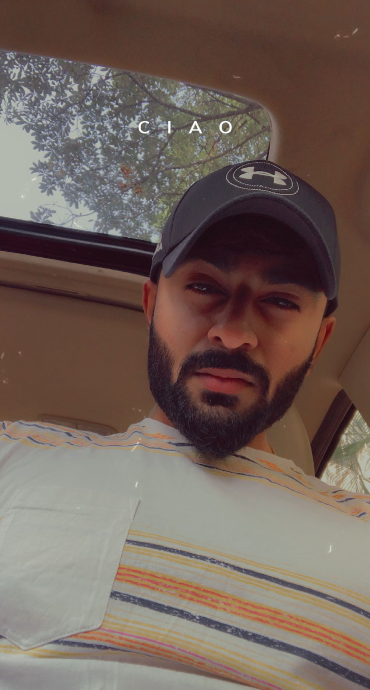

# Singireddy Karthik Reddy

# Contact no : +1-754-667-9663 
# Email : karthikr2299@gmail.com

## Career Objective:

-	To secure a position where I can efficiently contribute my skills and abilities to the growth of the organization and build my professional career.

- To excel in my field through hard work, research, skills and perseverance.

## Educational Qualifications:

- Bachelors of Technology in, 
- (Computer Science Engineering)	Geethanjali College of Engineering and Technology (GCET)	

- Jawaharlal Nehru Technological University, Hyderabad (2016-2020)	
  CGPA - 7.69
  
- Intermediate : Sri Chaitanya Junior College, Board of Intermediate Education (2014-2016), Percentage - 94.3%

- Class X :	Indus Universal School, Central Board of Secondary Education (CBSE)	(2013-2014), CGPA - 9.0

## Technical Skills:

-	Programming Languages       : MS Office, C, Java, Python. 

-	Database concepts           : MYSQL.

-	Web Technologies            : HTML, CSS, PHP, JSP.

-	Operating Systems           : Windows 8, Windows 10, Linux(Ubuntu)

-	Software Tools known        : Eclipse IDE, Putty.

# Academic Projects:

> Title : Audio Fingerprinting and Recognition 

Description: The project designed here is to automatically identify the file that contains the fragment in a large library potentially consisting of many audio files from a given short audio fragment as a query. 

> Title : Smart home Automated Control System

Description: The project work demonstrates a system that can be integrated as a single portable unit allows one to wirelessly control lights, fans, air conditioners, TV, computer systems, an audio, video equipment’s etc.  

# Achievements:

-	Internship at ECIL on Mobile Application Development. 

-	Internship at Wissen Infotech on Computer Networking.

-	Volunteered for the launch of research and development centre in AI & Robotics field.

-	Participated in coding & decoding at BHASWARA, a national level technical fest organized by Geethanjali College of Engineering and Technology. 

-	Coordinated the main college fest “VIBGYOR”, a national level cultural festival.

# Extra-Curricular Activities: 

*	Participated in ENIGMA at BITS 

*	Participated in OPEN MIC at GCET

*	Participated in Robotics Workshop conducted by Roboversity.

*	Participated in Roboveda-2018 at SNIST.

# Personal Profile:

* Name               : Singireddy Karthik Reddy

* Father’s Name      : Singireddy Mahipal Reddy

* Date of Birth      : 12 May 1999

* Gender             : Male

* Nationality        : Indian

* Languages known    : English, Telugu, Hindi

* Hobbies            : Playing Drums, Painting, Playing Cricket, Football, Badminton, Social service.

# Declaration:

- I hereby declare that the above furnishe

